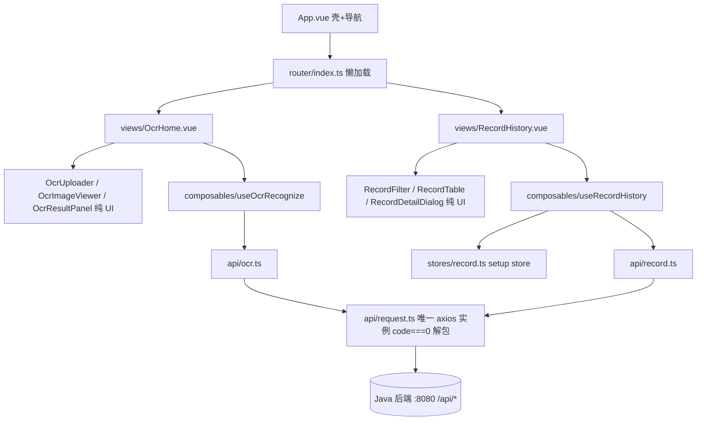

## 产品概述
PaddleOCR-web 前端单页应用：面向在线文字识别场景，含「识别主页」与「历史记录」两个页面，顶部导航切换，对接已有 Java 后端接口。

## 核心功能
- **图片识别**：拖拽/点击上传（jpg/jpeg/png/bmp/webp，≤10MB），上传前校验格式与大小；识别中展示加载状态
- **结果展示**：左侧原图 + 检测框叠加预览（归一化坐标定位、悬停查看文本与置信度）；右侧结果面板含全文（换行保留）、检测框列表（置信度可视化）、耗时统计，支持一键复制全文与导出 TXT
- **历史记录**：按文件名关键词筛选 + 分页表格；详情弹窗展示完整识别文本；删除带二次确认，删除后自动刷新、删空当前页时回退页码
- **全局**：接口失败/超时统一错误提示、空状态引导、加载态遮罩

## 视觉效果
浅灰底 + 白色卡片的工具型布局，蓝色科技感主色，卡片柔和阴影与悬停微动效，拖拽上传区虚线高亮反馈，整体清爽专业、信息密度适中。


## 技术栈（版本锁定，禁止改动）
- Vue 3.5.43 + TypeScript 5.9.3（strict）+ Vite 8.3.0（Node ≥ 20.19）
- Element Plus 2.14.6 + @element-plus/icons-vue 2.3.2（unplugin-auto-import 20.1.0 / unplugin-vue-components 29.0.0 按需引入）
- Pinia 4.0.3（setup store）+ vue-router 4.5.1 + Axios 1.20.0（单例 + 拦截器）
- vue-tsc 3.3.11：构建链 `vue-tsc -b && vite build`，类型不过禁构建

## 实现方案与关键决策
1. **以 templates.md 为基准、按后端实际裁剪**（SKILL.md 镜像规则优先于模板示例）：
   - 拦截器成功判定 `code === 0`（后端 `ResultCode.SUCCESS(0)`，非模板示例的 200）
   - `ApiResponse.timestamp` 为 `number`（long 毫秒），非 ISO 字符串
   - `OcrResult` 补 `recordId: string`；`OcrRecord.createTime` 为 `"yyyy-MM-dd HH:mm:ss"` 字符串
   - 记录接口补齐 3 个：分页 / 详情 / 删除
2. **分层**：`views → composables + stores → api → types`；components 纯 UI（校验后 emit 文件，不直调 API——不采纳模板中组件直调 API 的示例）；store 不调 ElMessage，UI 反馈归组件/composable 调用方
3. **代理**：后端 Controller 自带 `/api` 前缀、端口 8080 无 context-path → vite proxy `/api → http://localhost:8080` 无需 rewrite；axios baseURL=/api，代码内路径写 `/ocr/recognize`、`/records`
4. **性能**：路由懒加载；objectURL 在替换/卸载时 revoke 防内存泄漏；检测框用百分比定位（单次渲染 O(n)）；表格 key 用 `id`；分页页大小变更重置第 1 页
5. **tsconfig 裁剪**：模板原样 + `noEmit: true`（否则 `vue-tsc -b` 会在 src 产出 js）

## 系统架构


## 目录结构（全部新建于 `d:\ideaWorkSpace\PaddleOCR-web\frontend\`）
```
frontend/
├── index.html                      # [NEW] 挂载 #app，标题 PaddleOCR 在线识别
├── package.json                    # [NEW] 版本严格按 templates.md
├── tsconfig.json                   # [NEW] 模板原样 + noEmit: true，paths @/* → src/*
├── vite.config.ts                  # [NEW] vue + AutoImport/Components(ElementPlusResolver) + @ 别名 + /api 代理
├── .env.development                # [NEW] VITE_API_BASE_URL=/api
├── .env.production                 # [NEW] VITE_API_BASE_URL=/api
├── .gitignore                      # [NEW] node_modules/dist/auto-imports.d.ts 等
└── src/
    ├── main.ts                     # [NEW] createApp + pinia + router；禁 app.use(ElementPlus)
    ├── App.vue                     # [NEW] 壳：header 品牌名 + el-menu 路由模式 + router-view + footer
    ├── vite-env.d.ts               # [NEW] vite/client 引用 + ImportMetaEnv.VITE_API_BASE_URL 声明
    ├── styles/index.css            # [NEW] 全局基础样式（html/body/#app 100% 高度）
    ├── types/
    │   ├── api.ts                  # [NEW] ApiResponse/PageResult/PageQuery（镜像后端，timestamp: number）
    │   └── ocr.ts                  # [NEW] Point/TextBox/OcrResult(含 recordId)/OcrRecord(id string)
    ├── api/
    │   ├── request.ts              # [NEW] 唯一实例 timeout 60s；code!==0 → ElMessage.error+reject；解包返回 data；ECONNABORTED 超时提示
    │   ├── ocr.ts                  # [NEW] submitRecognize(file): Promise<OcrResult>，multipart FormData
    │   └── record.ts               # [NEW] fetchRecords(RecordQuery)/fetchRecordDetail(id)/removeRecord(id)
    ├── router/index.ts             # [NEW] / 重定向 OcrHome；/ocr、/history 懒加载
    ├── stores/record.ts            # [NEW] setup store：records/total/loading/loadRecords(pageNum,pageSize,keyword?)
    ├── composables/
    │   ├── useOcrRecognize.ts      # [NEW] recognizing/result/imageUrl；recognize(file)；reset() 含 revokeObjectURL
    │   └── useRecordHistory.ts     # [NEW] keyword/pageNum/pageSize/详情弹窗态；remove()：ElMessageBox.confirm → api → 删空页回退并刷新
    ├── components/
    │   ├── OcrUploader.vue         # [NEW] 纯 UI 拖拽上传；accept/maxSizeMb props；校验后 emit select(File)/error(msg)；:http-request 自定义
    │   ├── OcrImageViewer.vue      # [NEW] 原图 + 检测框百分比叠加（归一化坐标→left/top/width/height）；悬停 tooltip 文本+置信度
    │   ├── OcrResultPanel.vue      # [NEW] 统计条(框数/耗时)+全文 pre-wrap 插值+框列表(置信度 el-progress)+复制/导出 TXT；禁 v-html
    │   ├── RecordFilter.vue        # [NEW] defineModel keyword + emit search/reset
    │   ├── RecordTable.vue         # [NEW] el-table：文件名/摘要(ellipsis+tooltip)/耗时/时间/操作；emit detail/remove；:key=id
    │   └── RecordDetailDialog.vue  # [NEW] defineModel visible + props record；descriptions + 文本滚动区
    └── views/
        ├── OcrHome.vue             # [NEW] 编排三组件 + useOcrRecognize；空状态引导
        └── RecordHistory.vue       # [NEW] 编排筛选/表格/分页/弹窗 + useRecordHistory + store
```

## 关键代码结构（前后端契约镜像，多方依赖）
```ts
// src/types/api.ts —— 与后端 common/ApiResponse 逐字段镜像
export interface ApiResponse<T> {
  code: number      // 0 成功；4xxxx 客户端；5xxxx 系统；503xx OCR 服务
  message: string
  data: T | null
  timestamp: number // 后端 long 毫秒，非 ISO 字符串
}
```
```ts
// src/types/ocr.ts —— 镜像 OcrResultVO/TextBoxVO/OcrRecordVO
export interface TextBox {
  text: string
  confidence: number                     // 0-1
  points: Array<{ x: number; y: number }> // 归一化 0-1
}
export interface OcrResult {
  fullText: string
  textBoxes: TextBox[]
  costMs: number
  recordId: string   // 雪花 ID 字符串，禁止 number
}
export interface OcrRecord {
  id: string
  fileName: string
  resultText: string
  costMs: number
  createTime: string // "yyyy-MM-dd HH:mm:ss"（JacksonConfig 全局格式）
}
```

## 实施注意事项
- 拦截器解包后接口函数返回 `Promise<T>`（不再是 `Promise<ApiResponse<T>>`）
- ID 一律 `string`；禁 any / v-html / index 作 key / console.log / `@ts-ignore`
- 组件一律 `<script setup lang="ts">`，区块顺序 script → template → style(scoped)
- ElMessage/ElMessageBox 经 auto-import 使用；上传走 `:http-request`，禁 action 直连
- 日志仅开发期 console.warn/error，禁打印 base64/完整 OCR 大文本
- 环境变量仅经 `import.meta.env.VITE_XXX` 访问


## 设计风格
现代工具型应用风格（Clean & Professional）：浅灰画布 + 白色圆角卡片 + 柔和阴影，Element Plus 蓝为主基调，顶栏深蓝渐变营造科技感；关键操作（上传区、按钮、表格行）带悬停微动效，信息层级清晰、留白适中。桌面优先、中屏自适应（结果区左右分栏，窄屏堆叠）。

## 页面规划（2 路由页 + 全局壳）
**全局壳（App.vue）**：顶部导航栏：左侧品牌标识「PaddleOCR」+ 副标「在线文字识别」，右侧 el-menu 横向路由菜单（OCR 识别 / 历史记录），选中态高亮；下方主内容区居中限宽（1200px）；底部轻量页脚。

**识别主页（/ocr）**：
- 上传区块：大尺寸虚线拖拽卡片，居中上传图标与「拖拽图片到此处，或点击上传」提示，下方灰色小字注明格式（jpg/png/bmp/webp）与 10MB 限制；识别中显示加载遮罩与进度提示
- 预览区块：白色卡片内原图居中展示，检测框以半透明蓝色描边叠加，悬停高亮并浮层显示该框文本与置信度
- 结果面板：统计条（文本框数量、耗时 ms）；全文以等宽风格 pre-wrap 展示；检测框列表每项含序号、文本、置信度进度条（颜色随置信度渐变）；顶部「复制全文」「导出 TXT」按钮
- 空状态：初次进入展示引导文案与插画式占位

**历史记录页（/history）**：
- 筛选栏：文件名关键词输入框 + 搜索/重置按钮，与标题同行
- 记录表格：文件名、识别结果摘要（单行省略 + tooltip）、耗时、识别时间、操作列（详情/删除，删除为红色文字按钮）
- 分页器：右下角，含总条数与页大小切换（10/20/50）
- 详情弹窗：descriptions 展示元信息 + 可滚动完整识别文本区；删除操作弹 ElMessageBox 二次确认


## Agent Extensions
### Skill
- **paddleocr-frontend-conventions**
  - Purpose: 全部 frontend 代码生成的最高优先级规范——版本锁定、分层依赖方向、TS 红线、EP 按需引入、axios 契约（code===0 解包）、ApiResponse 镜像规则、命名与常见错误对照
  - Expected outcome: 生成的前端代码与项目规范零冲突，可直接通过 vue-tsc 类型检查并与后端契约精确对齐
- **vue-best-practices**
  - Purpose: 组件边界划分（views 薄编排、components 纯 UI、逻辑下沉 composables）、SFC 结构、props/emits/defineModel 类型化契约、状态最小化
  - Expected outcome: 组件职责单一、数据流清晰（props down / events up），composable API 小而可测
