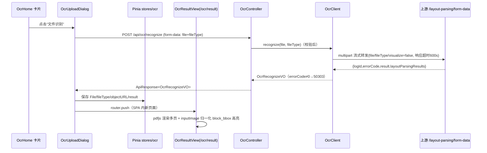

## 用户需求

### 功能入口
- 首页“文件识别”卡片（原为纯展示）变为可点击：点击后弹出文件上传弹框。
- 弹框支持选择 PDF 与图片文件（jpg/jpeg/png/bmp/webp/pdf，单文件 ≤10MB），含本地预检与友好错误提示；点击“确定”后发起识别请求，请求期间按钮呈识别中状态且不可关闭弹框，成功后关闭弹框并跳转结果页。

### 接口契约（用户指定）
- 调用 `/api/ocr/recognize`，form-data 传输两个 key：`file`（文件）、`fileType`（0=PDF，1=图像）。
- 返回结构为接口文档所述 layout-parsing 结构：`layoutParsingResults[]` 按页排列，每页含 `prunedResult.parsing_res_list[]`（`block_bbox` 四值像素坐标、`block_label`、`block_content`、`block_id`、`block_order`，顺序即阅读顺序）、`markdown.text`、`inputImage`。

### 结果对照页（站内新页面，非新浏览器标签）
- 布局：顶部信息栏（文件名、返回首页、复制全文）；左侧为文件预览区（PDF 逐页渲染、多页上下滚动，图片则单图展示）；中间为识别内容区（按页分组、按阅读顺序展示文本块，可点击）。
- 核心交互：点击中间任一内容块 → 左侧自动滚动到对应页与对应位置，该区域以红色半透明背景高亮显示（基于 `block_bbox` 坐标换算），中间对应块同步选中态。
- 边界：直接访问/刷新结果页无数据时重定向回首页并提示；识别失败由统一拦截器提示且弹框保留可重试。

### 视觉效果
延续现有平台风格（深色侧边栏、蓝色主色调、浅灰工作区），结果页为双栏工作台式布局，高亮采用红色背景蒙层并带平滑滚动定位。


## 技术栈

### 后端（对齐新契约，遵循项目既有分层 ocr-web → ocr-service → ocr-client → ocr-common）
- JDK 8 + Spring Boot 2.7.18 + HttpClient5 multipart 流式转发 + Hutool JSON 解析（全部既有依赖，零新增）。
- 关键决策：
  - **上游端点**：`OcrApi.RECOGNIZE` 由 `/ocr/recognize` 改为 `/layout-parsing/form-data`（接口文档 §4.3 的 multipart 变体，入参恰为 `file`+`fileType`，响应即目标结构）；联调若上游路径不同仅改此单点。
  - **响应包装**：保持项目铁律 `ApiResponse<T>`，`data` 内为 layout-parsing 结构（前端走既有拦截器解包）；上游信封 `{logId,errorCode,errorMsg,result}` 中 `errorCode≠0` → 50303（message 携带 errorMsg）。
  - **新 VO（Hutool `@Alias` 处理 snake_case → camelCase，未知字段忽略）**：`OcrRecognizeVO{layoutParsingResults}` → `OcrLayoutPageVO{prunedResult, markdown, inputImage}` → `OcrPrunedResultVO{parsingResList}` → `OcrParsingBlockVO{blockBbox, blockLabel, blockContent, blockId, blockOrder}` → `OcrMarkdownVO{text}`；`markdown.images` 的 base64 不透传（减载荷）；删除旧模型 `OcrResultVO`/`TextBoxVO`。
  - **入参扩展**：Controller/Service/OcrClient 全链路增加 `fileType`（Integer，必填，缺 part → 既有 Handler 转 40000；值域校验 ∈{0,1} 否则 40000）；上游 multipart 额附加 `fileType` 与 `visualize=false`（清空 outputImages 但保留 inputImage，见文档 §5 示例）。

### 前端（沿用既有栈 + 一项新依赖）
- Vue 3.5 + TypeScript + Vite 8 + Element Plus（unplugin 自动导入）+ Pinia 4 + Axios 1.20；新增 `pdfjs-dist@5.x`（PDF 逐页 canvas 渲染，worker 经 `?url` 导入注入 `GlobalWorkerOptions.workerSrc`）。
- 关键决策：
  - **坐标映射**：`block_bbox` 为上游渲染页图像（即 `inputImage`）像素坐标；前端每页用 `inputImage` 的 naturalWidth/Height 归一化为 0-1，再乘以 pdfjs 画布渲染尺寸定位高亮（inputImage 与画布同为整页渲染、宽高比一致）；`inputImage` 缺失时回退按 PDF 视口 144dpi 假设并注释说明。
  - **数据传递**：识别结果经 Pinia store（`stores/ocr.ts`：File、fileType、objectURL、result）传给结果页；objectURL 在替换/清空时 revoke；结果页无数据 → 重定向首页提示。
  - **长请求**：`api/ocr.ts` 单请求 `timeout: 600_000` 覆写实例默认 60s；FormData 交由浏览器自动生成含 boundary 的 Content-Type（不手动设置）。
  - **表格块渲染**：`block_label=table` 的 `block_content` 为 HTML，在独立作用域容器内 v-html 渲染（同用户自有文档数据，风险可控），其余块按纯文本 pre-wrap 渲染。

## 架构设计（调用链路）


## 目录结构（变更文件清单）
```
PaddleOCR-web/
├── backend/
│   ├── ocr-client/src/main/java/com/paddleocr/web/client/
│   │   ├── constant/OcrApi.java            # [MODIFY] RECOGNIZE 路径改为 /layout-parsing/form-data，注释同步（图片/PDF 版面解析）
│   │   ├── OcrClient.java                  # [MODIFY] recognize(file, fileType)：multipart 追加 fileType、visualize=false part；信封解析（JSONObject 校验 errorCode，result→toBean OcrRecognizeVO）；异常映射 50301/50302/50303 不变
│   │   └── model/
│   │       ├── OcrRecognizeVO.java         # [NEW] 顶层结果：layoutParsingResults 列表
│   │       ├── OcrLayoutPageVO.java        # [NEW] 单页：prunedResult + markdown + inputImage
│   │       ├── OcrPrunedResultVO.java      # [NEW] parsingResList（@Alias("parsing_res_list")）
│   │       ├── OcrParsingBlockVO.java      # [NEW] blockBbox(List<Integer>,@Alias block_bbox)/blockLabel/blockContent/blockId/blockOrder
│   │       ├── OcrMarkdownVO.java          # [NEW] text（images 不透传）
│   │       ├── OcrResultVO.java            # [DELETE] 旧契约模型
│   │       └── TextBoxVO.java              # [DELETE] 旧契约模型
│   ├── ocr-service/src/main/java/com/paddleocr/web/service/
│   │   ├── OcrRecognizeService.java        # [MODIFY] recognize(file, fileType)
│   │   └── impl/OcrRecognizeServiceImpl.java # [MODIFY] 增加 fileType 值域校验(∈{0,1}→40000)，三重文件校验保留
│   ├── ocr-web/src/main/java/com/paddleocr/web/controller/OcrController.java # [MODIFY] 增加 @RequestParam("fileType") Integer fileType
│   ├── ocr-client/src/test/java/com/paddleocr/web/client/OcrClientTest.java # [MODIFY] 契约更新：新响应夹具(按接口文档§5)、fileType 透传断言
│   └── ocr-service/src/test/java/com/paddleocr/web/service/impl/OcrRecognizeServiceImplTest.java # [MODIFY] 补 fileType 校验用例(缺失/非法/合法)
└── frontend/
    ├── package.json                        # [MODIFY] 新增 dependencies: pdfjs-dist
    └── src/
        ├── types/ocr.ts                    # [NEW] 镜像后端 VO 的 TS 类型（见关键代码结构）
        ├── api/ocr.ts                      # [NEW] submitOcrRecogn[User Cancelled]
